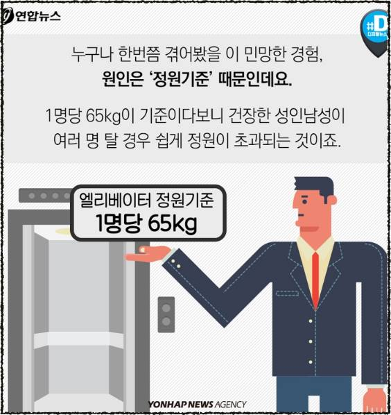
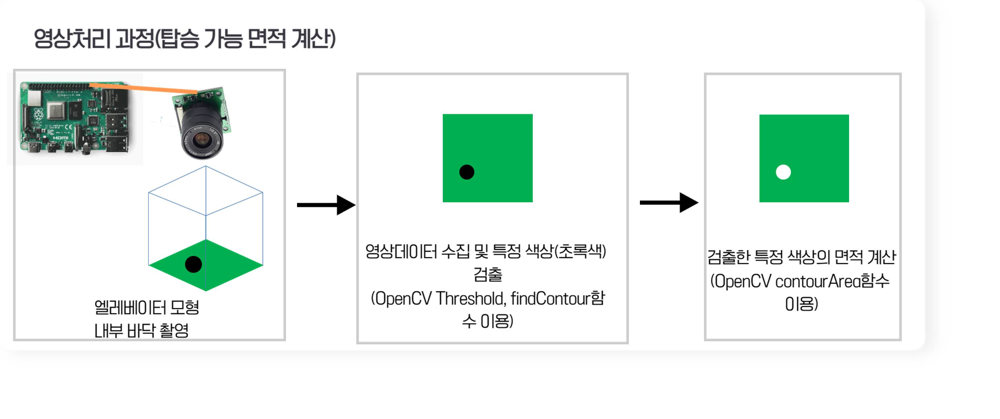
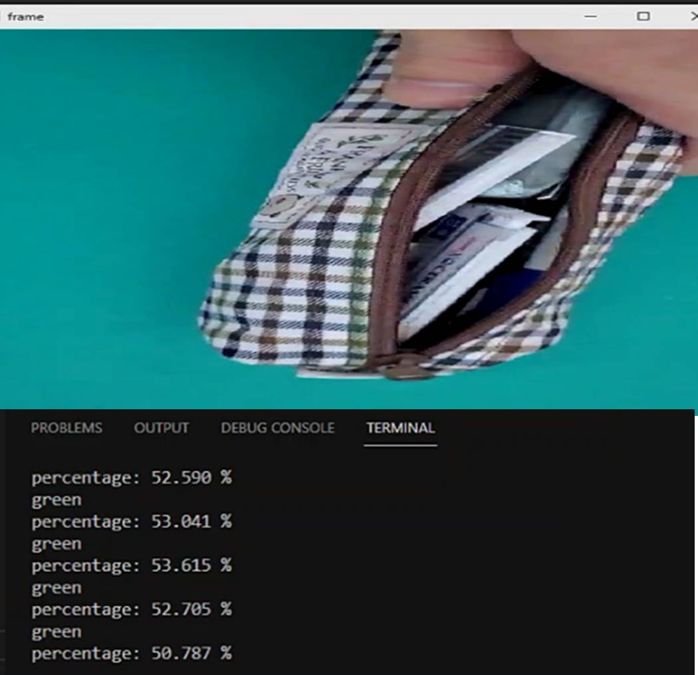
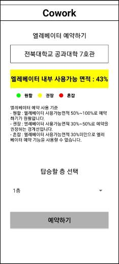
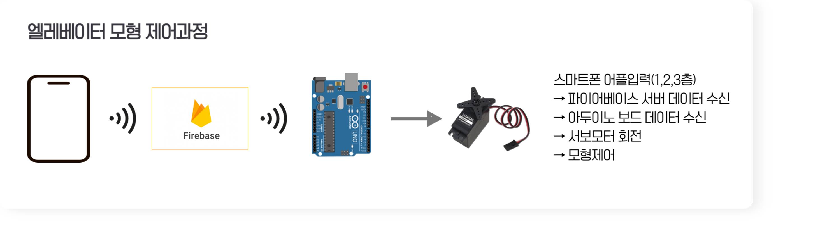
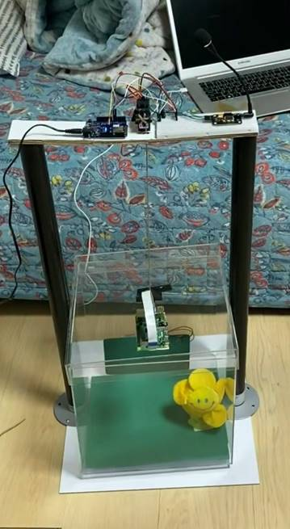

# 공공장소 엘리베이터 솔루션

## 작품개요 - 제작동기

- 엘리베이터 '인원초과 인식 시스템'의 단점
 : 기존의 엘리베이터 인원 초과는 '무게'로 인식하는 시스템이었다. 이 시스템의 단점은 엘리베이터 내부에 탈 공간이 없더라도 무게가 초과하지 않으면 인원초과라고 보지 않는 것이다. 이러한 경우 엘리베이터 내부에 탈 공간이 없음에도 불구하고 엘리베이터 외부에서 버튼을 누르는 층마다 멈춰설 것이다. 이는 엘리베이터 이용 인원이 많을 경우 혼잡을 초래한다.

## 작품 목표
- 엘리베이터 '무게초과 인식 시스템'으로 인해 발생하는 혼잡을 막기 위해 '무게'로 인원초과를 아닌 다른 시스템을 개발한다.

## 작품 설명
1. 영상처리 기술을 이용한 엘리베이터 인원 초과 인식 시스템
 
- 엘리베이터 내부 CCTV를 통해 영상을 얻은 뒤, 영상처리 기술을 통해 엘리베이터 내부에 탑승가능한 면적을 계산한다. 계산한 면적을 퍼센트로 환산하여 10%이하일 때는 외부에서 버튼을 눌러도 엘리베이터가 멈춰서지 않는다.(탑승가능 면적을 인식하기 위해 엘리베이터 내부 바닥을 특정 패턴이 있는 바닥으로 하거나 특정 색으로 설계해야한다.)

- 계산한 엘리베이터 면적을 퍼센트로 스마트폰 어플리케이션에 출력한다. 이 기능은 엘리베이터를 이용하기 전에 미리 탑승 가능할 것인지 확인하고, 바쁜 경우에는 계단을 이용할 수 있도록 할 수 있다.(서버 통신은 Firebase를 이용한다.)

2. 동작 확인을 위한 엘리베이터 모형 제어 과정

- 영상처리를 통한 인원 초과 시스템이 잘 작동하는지 확인하기 위해 엘리베이터 모형을 모터로 제어한다. 스마트폰 어플리케이션으로 층을 선택한뒤 엘리베이터 예약을 누르면 해당 층으로 이동하지만, 인원 초과라고 인식될 때는 이동하지 않는다.

## 작품 사진

